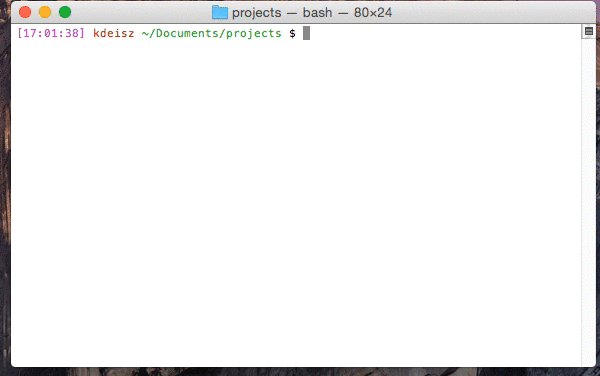

#serverless-slackbot-scaffold

This project is a [khaos template](https://github.com/segmentio/khaos) for building an AWS lambda service that acts as a [slack slash commands](https://api.slack.com/slash-commands) processor. It uses the [Serverless framework](https://github.com/serverless/serverless) for easier deployment to AWS.

## Usage

From the [custom integrations page](<https://slack.com/apps/manage/custom-integrations>) in slack, add a "Slash Commands" integration and retreive the slack verification token.

Install khaos

    $ npm install -g khaos

Install the template to your local machine

    $ khaos install localytics/serverless-slackbot-scaffold slackbot

Run the templating engine

    $ khaos create slackbot <project-name>

You will be prompted to fill in metadata fields about the project. The names and descriptions of each field are below:

* `slack-token`: The token displayed on the custom integration page in slack.
* `aws-access-key-id`: Your AWS access key id. This will be used for deploys, and will be gitignored.
* `aws-secret-access-key`: Your AWS secret access key. As above, it will be used for deploys and gitignored.
* `author`: The name of the author of this slackbot. It is used inside of the two package.json files.
* `github-user-or-org`: The owner of this repository. As above, it is used in the package.json files.
* `aws-s3-bucket`: The bucket to which to deploy resources for the slackbot. This will need to follow the Serverless convention of having the region in the name, and will typically look something like serverless.us-east-1.localytics.
* `notification-email`: The email to which to send notifications about the lambda.

Once every field has been filled in, a new directory will be created that will contain your templated slackbot.

## Development

Refer to the templated README file within the new project directory for configuration, deployment, and testing instructions.

## Testing

For testing the template itself, run `extras/test.sh`. Note for test speed, the dependencies are then cached for all subsequent runs in `cache`.
